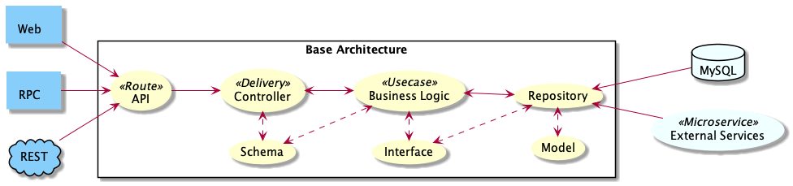

# Fast Api - Base Architecture

[](../../actions)


:bulb: This architecture use the domain layer concept of [laravel](https://laravel.com/) from PHP, [rails](https://rubyonrails.org/) from Ruby and [clean-architecture](https://github.com/bxcodec/go-clean-arch#the-diagram) from Golang . By using this architecture, we hope that you don't need to create FastApi from scratch again. Then you can focus on your development with our standardized pattern.

## :man_dancing: Architecture

```python
.
|
└── alembic                 # My name is Alembic, your database migration manager
    ├── versions                # Any migration database stored at me.
    └── README.md               # All related documentation about alembic stored at me, so please read me
└── app                     # I'm the app folder, that consist of:
    ├── deliveries              # I'm a controller with router, I will delivery your request :)
    ├── middlewares             # I'm a cool middleware, don't me?
    ├── models                  # I will connecting you with the database structure
    ├── repositories            # I'm a repositories, just like you ever know ;)
    ├── usecases                # Use me as services, so that you can create any usecases!
    ├── schemas                 # Don't you dare to ignore me. I will help all of data structure
    └── __init__.py             # In python, I will handle this sub-folder, so that you can easily calling them
└── config                  # Config anything ? Write on me then :D
    └── database.py             # You can do database configuration at me. Remember that!
    └── __init__.py             # Nice to meet you again!
└── out                     # You can place any related documentation at me, e.g. changelog, PR guide, etc.
└── test                    # Warning! You must create me (unit test) before ask them!
    └── {{all_unit_testing}}
    └── __init__.py
└── env.py                  # I am the env.example, do you remember ?
└── export.sh               # I am the script that you need to export your current database as a backup.
└── import.sh               # If you need to import the previously backed up database, please call me :)
└── main.py                 # Call me, then you will have your app running :3
└── readme.md               # You in me right now ;)
```

## :pushpin: Domain Layer



---

## :computer: Setup & Installation

### Database Migrations

We use `alembic` database migrations. So please [read this documentation](alembic) for more info.

### Secret Key

Create `SECRET_KEY` by:

```
openssl rand -hex 32
```

Add `.env` file with some value from [env.example](env.py)

## :rocket: Docker Installation

```
docker-compose up --build -d
```

Or see Manual Installation in [here](#manual-installation)

> For easily remove docker, you can use: docker-compose down

---

## :clipboard: Documentation

### Swagger

> Now go to [http://127.0.0.1:8000/docs](http://127.0.0.1:8000/docs).
> You will see the automatic interactive API documentation (provided by Swagger UI)

### Alternative Documentation

> And now, go to [http://127.0.0.1:8000/redoc](http://127.0.0.1:8000/redoc).
> You will see the alternative automatic documentation (provided by ReDoc)

## :pencil: Typography

Since we use python, we use **Snake Case** for naming convention. But please note that snake_case not belongs to:

- `Class names` **MUST** be declared in StudlyCaps (ie: PascalCase).
- `PR title/description` **MUST** be use this [PR guide](out/pull_request.md).
- `ChangeLog` **NO NEED** to update manual. It will automatically created at [Changelog Page](out/changelog.md).

## :zap: Unit Test

For unit test, we only do 3 unit test:
- **Feature Unit Test**
    - For feature unit testing you need to follow [items testcase](test/routes/items_test.py). That is the example of unit test and you can easily copy paste and rename some prefix.
- **Usecase Interface Unit Test**
    - For usecase interface unit testing you just need to edit [usecase interface testcase file](test/interfaces/service_interface_test.py). You need to call your service/usecase ([how to?](test/interfaces/service_interface_test.py#L5)) and create check subclass unit test ([how to?](test/interfaces/service_interface_test.py#L9-L10))
- **Repository Interface Unit Test**
    - Almost same with usecase interface, for repository interface unit testing you just need to edit [repository interface testcase file](test/interfaces/repository_interface_test.py). You need to call your repository ([how to?](test/interfaces/repository_interface_test.py#L5)) and create check subclass unit test ([how to?](test/interfaces/repository_interface_test.py#L9-L10))

### Run Unit Test

```console
pytest

# Check Coverage
pytest --cache-clear --cov=app --cov-config=.ignorecoveragerc test/

# Create Coverage Report
pytest --cache-clear --cov=app --cov-config=.ignorecoveragerc --cov-report html test/
open htmlcov/index.html
```
    

## :traffic_light: Http Status Codes

> Useful informations about each kind of http code

## Shortcut to remember the names

> You don't have to memorize what each of these codes mean. You can use the convenience variables from `fastapi.status`


## List of codes

The list is separated by kind.

### Success 2xx

These codes indicate success. The body section if present is the object returned by the request. It is a MIME format object. It is in MIME format, and may only be in text/plain, text/html or one fo the formats specified as acceptable in the request.

- [200](http://httpstatus.es/200) - **Ok** - The request was fulfilled.
- [201](http://httpstatus.es/201) - **Created** - Following a POST command, this indicates success, but the textual part of the response line indicates the URI by which the newly created document should be known.
- [202](http://httpstatus.es/202) - **Accepted** - The request has been accepted for processing, but the processing has not been completed. The request may or may not eventually be acted upon, as it may be disallowed when processing actually takes place. there is no facility for status returns from asynchronous operations such as this.
- [204](http://httpstatus.es/204) - **No Response** - Server has received the request but there is no information to send back, and the client should stay in the same document view. This is mainly to allow input for scripts without changing the document at the same time.

### Client side errors 4xx

The 4xx codes are intended for cases in which the client seems to have erred, and the 5xx codes for the cases in which the server is aware that the server has erred. It is impossible to distinguish these cases in general, so the difference is only informational.

The body section may contain a document describing the error in human readable form. The document is in MIME format, and may only be in text/plain, text/html or one for the formats specified as acceptable in the request.

- [400](http://httpstatus.es/400) - **Bad Request** - The request had bad syntax or was inherently impossible to be satisfied.
- [401](http://httpstatus.es/401) - **Unauthorized** - The parameter to this message gives a specification of authorization schemes which are acceptable. The client should retry the request with a suitable [Authorization](http://www.w3.org/Protocols/HTTP/HTRQ_Headers.html#z9) header.
- [403](http://httpstatus.es/403) - **Forbidden** - The request is for something forbidden. Authorization will not help.
- [404](http://httpstatus.es/404) - **Not Found** - The server has not found anything matching the URI given.
- [409](http://httpstatus.es/409) - **Conflict** - Request could not be processed because of conflict.

### Server side error 5xx

This means that even though the request appeared to be valid something went wrong at the server level and it wasn’t able to return anything.

- [500](http://httpstatus.es/500) - **Internal Error** - The server encountered an unexpected condition which prevented it from fulfilling the request.

---

## Manual Installation

Dependencies Installation

```console
pip3 install -r requirements.txt
```

---

### Manual Run App

```console
python3 main.py
```

---

## :card_file_box: Database Export and Import

### Exporting Database

Exporting Database could be done by executing the script of file `export.sh`

Pre-requisites to fill in `.env` file:
- **DB_BACKUP_PATH** - Specify the path for the export result.
- **DB_HOST** - Specify host of your database. (ex: *localhost*, *docker*)
- **DB_PORT** - Specify port of your database connection.
- **DB_USERNAME** - Specify credentials of your database connection.
- **DB_PASSWORD** - Specify credentials of your database connection.
- **DB_DATABASE** - Specify name of the database you want to export.
- **DB_CONTAINER_NAME** - Specify name of database container you want to export in Docker.
- **DB_BACKUP_TABLE_NAME** - Specify table names you need to export separated by space. (ex: *'items users transactions products'*)
- **BACKUP_RETAIN_DAYS** - Specify the expiry date of exported database. (ex: 30)

### Importing Database

Importing Database could be done by executing the script of file `import.sh`

Pre-requisites to fill in `.env` file:
- **DB_BACKUP_PATH** - Specify the path for the export result.
- **DB_HOST** - Specify host of your database. (ex: *localhost*, *docker*)
- **DB_PORT** - Specify port of your database connection.
- **DB_USERNAME** - Specify credentials of your database connection.
- **DB_PASSWORD** - Specify credentials of your database connection.
- **DB_DATABASE** - Specify name of the database you want to export.
- **DB_BACKUP_TABLE_NAME** - Specify table names you need to export separated by space. (ex: *'items users transactions products'*)
- **DB_BACKUP_FILE_NAME** - Specify the name of the exported database file.


